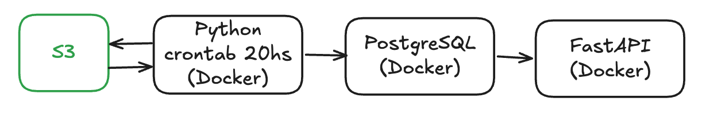

<h1 align="center">
  
</h1>

# ⚙️ timesheet-api

Esta API facilita endpoints con información que se genera en Azure DevOps.

## 🚥 Flujo

- Contamos un con un S3 que almacena archivos **.json** con información histórica de Work Items de Azure DevOps.
- Tenemos un contenedor con Python que ejecuta un proceso el cual, actualiza el S3, transforma los datos y los almacena en un PostgreSQL, que también es un contenedor.
- Contamos con un PostgreSQL que tiene la información organizada
- Luego contamos con una API para poder ofrecer los datos almacenados en PostgreSQLs



## 🚀 Cómo ejecutar este proyecto
1. Crear un archivo **.env** y agregar las siguientes variables de entorno:

```bash
  # Configuración Azure DevOps
  ACCESS_TOKEN = 'xxxxx'
  AZURE_URL = 'xxxxx'
  # Conf S3
  aws_access_key_id = 'xxxxx'
  aws_secret_access_key = 'xxxxx'
  serial_number = 'xxxxx'
  clave_secreta_MFA = 'xxxxx'
  # Configuración de PostgreSQL
  DB_USER = 'xxxxx'
  DB_PASSWORD = 'xxxxx'
  DB_HOST = 'xxxxx'
  DB_PORT = 'xxxxx'
  DB_NAME = 'xxxxx'
```

2. Tener Docker corriendo y ejecutar el siguiente comando:
```shell
docker compose up -d
```
3. Una vez creados los contenedores, aún tiene que terminar de correr el etl que trae datos, podemos ir viendo la ejecución en este contenedor con el siguiente comando:
```shell
docker logs -f etl
```
4. Una vez terminado el proceso anterior, ya podemos acceder a la API revisando su documentación en http://localhost:8000/docs

⚠️ **Validar que no corran otros proyectos en el puerto 5432 y 8000. Se puede acceder al contenedor "etl" para ejecutar el proceso de carga cuando sea necesario.**

## Mejoras
- [ ] Agregar validadores a todos los endpoints.
- [ ] Crear los tests.
- [ ] Mejoraras en la carpeta etl
- [ ] En settings modificar colaboradores_verticales.csv por un json
- [ ] ...

## Contribuidores
- Pablo Piccoli
- Juan Cruz Romero