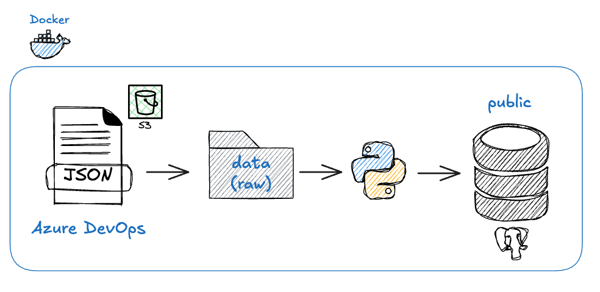

<h1 align="center">
  
</h1>

# ETL
Proceso de extracción y carga de datos

## Flujo
Tenemos un contenedor llamado "etl" que ejecuta un proceso etl diariamente, definido en un cron.

- Nos conectamos a Azure DevOps para obtener información de horas cargadas de los colaboradores en Urbetrack.
- Luego almacenamos archivos **.json** en un cluster de S3 para guardar la información histórica.
- Creamos una carpeta llamada "Data", obtenemos los archivos que hay aquí, los limpiamos y los guardamos en PostgreSQL, que es otro contenedor que cuenta esta aplicación.

